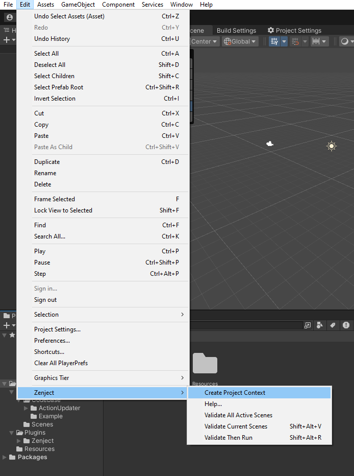
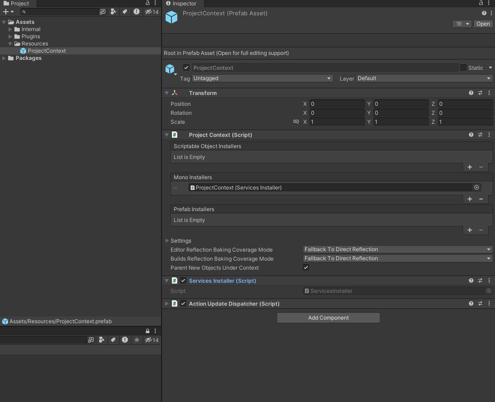
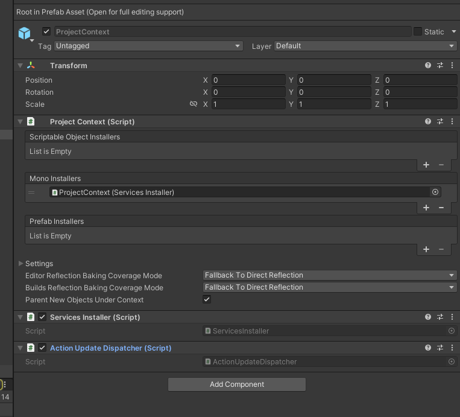
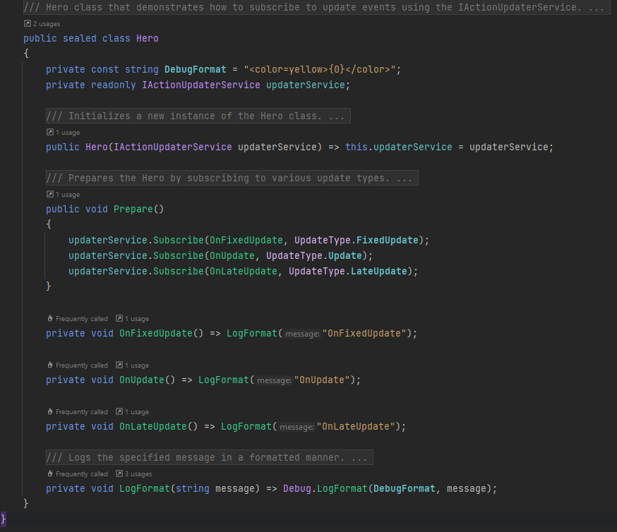
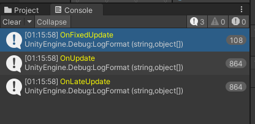

# ActionUpdaterService for Unity

## Overview

`IActionUpdaterService` is a flexible and easy-to-use service for Unity, designed to manage and dispatch update-related
actions (`FixedUpdate`, `Update`, `LateUpdate`) outside of `MonoBehaviour`. It allows for a more modular approach to
handling updates, especially useful in projects using dependency injection frameworks like Zenject.

## Features

- Separate update methods (`FixedUpdate`, `Update`, `LateUpdate`) outside `MonoBehaviour`.
- Easy subscription and unsubscription of actions.
- Pause functionality to control the execution of update actions.
- Automatic cleanup to prevent memory leaks.

## Getting Started

### Installation

1. Import the `IActionUpdaterService` package into your Unity project.
2. Add `ActionUpdaterService` and `ActionUpdateDispatcher` scripts to your project.

### Zenject Binding

Bind the `IActionUpdaterService` in your Zenject installer like this:

```csharp
public sealed class ServicesInstaller : MonoInstaller
{
    public override void InstallBindings()
    {
        Container.Bind<IActionUpdaterService>().To<ActionUpdaterService>().AsSingle();
    }
}
```
Don't forget to add to the ProjectContext:




# Dispatcher
Add the `ActionUpdateDispatcher` class to the ProjectContext prefab, Bootstrupper or any other object that will be the only one in the game.



# Usage

Inject IActionUpdaterService into your classes and subscribe to the desired update methods:

```csharp
public sealed class YourClass
{
    private IActionUpdaterService actionUpdater;

    [Inject]
    private void Constructor(IActionUpdaterService actionUpdater) =>
        this.actionUpdater = actionUpdater;

    public void SomeMethod()
    {
        actionUpdater.Subscribe(MyUpdateMethod, UpdateType.Update);
    }

    private void MyUpdateMethod()
    {
        // Your update logic here
    }
}
```

Remember to unsubscribe from the service to prevent memory leaks:

```csharp
public void OnDestroy()
{
    actionUpdater.Unsubscribe(MyUpdateMethod, UpdateType.Update);
}
```

# Pausing Updates

You can pause and resume the execution of update methods:

```csharp
actionUpdater.SetPause(true); // Pauses updates
actionUpdater.SetPause(false); // Resumes updates
```

# Example



# License

This project is licensed under the MIT License - see the LICENSE file for details.

## Credits

Developed by RimuruDev.